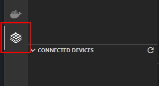
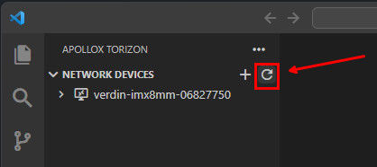
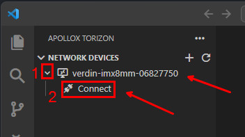
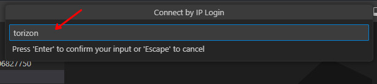
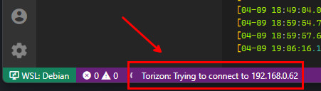
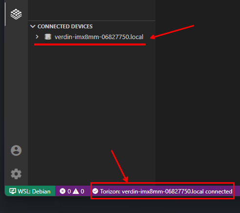
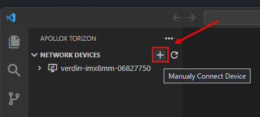
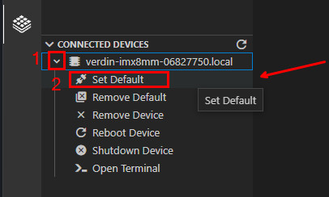
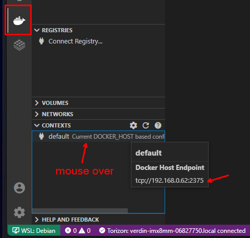
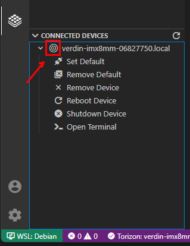

# Connecting a Torizon Device

For use of the Torizon integrated development environment features a device with [Torizon OS](https://www.toradex.com/operating-systems/torizon-core) must be registered to be used with the extension.

## Connecting to a Torizon Device

> ⚠️ The Torizon device must be connected to the same network as the machine running the VS Code extension.

Select the Torizon icon in the activity bar to scan for devices in your local network:

Also is possible to re-scan the devices clicking in the `Refresh Devices` icon:

After the scan, expand the device, then to registry it click on `Connect`:

A prompt will be shown to input the user name, and another one to input password for the Torizon device:

Wait for the connection to be established. You can follow the progress in the footer of the VS Code window:

After the connection the device will be listed under `CONNECTED DEVICES`, and the footer will show the connection status:

> ⚠️ In some network configurations the device may not be detected. (this is a known issue). If it's your case, you can manually add the device by clicking on the `+` icon and input the Torizon device `IP`:

### Setting a Torizon Device as Default

Multiple Torizon devices can be registered. To use the Torizon integrated development environment features a device must be selected as default. Expand a connected device and click on `Set Default`:

The default device will be used as target for the remote deploy, remote debug.

Also the default device will be used as `DOCKER_HOST` for the [Docker VS Code extension](https://marketplace.visualstudio.com/items?itemName=ms-azuretools.vscode-docker). You can check it clicking in the `CONTEXTS` menu from the Docker activity bar:

The management of the Torizon default device Docker containers, images, volumes and networks can all be used by the Docker VS Code extension.

To differentiate between the registered devices and default device, the icon changes to:

