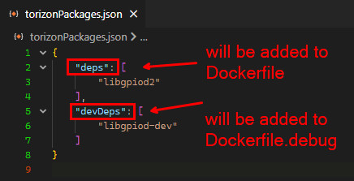
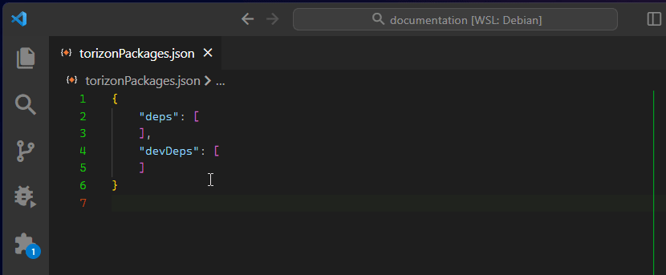
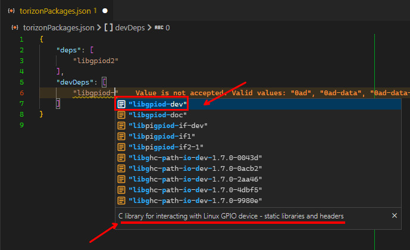

# Debian Torizon Packages

ApolloX supports easy search trough Debian packages to be added on the `Dockerfile` and `Dockerfile.debug` files. The `torizonPackages.json` file is used to list the packages that will be installed on the production and debug images.

> ⚠️ You can also edit the `Dockerfile` and `Dockerfile.debug` files manually to add the packages that you want to install. But we recommend to use the `torizonPackages.json` file to help you with the auto-completion and the search trough the packages.

## Auto-completion (search packages)

On the `torizonPackages.json` file, you can use the auto-completion to search for the packages that you want to install. There are two arrays on the file, one for the production packages and another for the debug packages. The auto-completion will search for the packages on both arrays:



To trigger the auto-completion type `Ctrl + Space` inside the array, wait for the loading and start typing the package name:



The list will also show the package description:



> ⚠️ If the package does not show the description, type again `Ctrl + Space`, this is a VS Code shortcut to hide and show a list item description.

## Selecting Debian Release

By the default, the extension will use the `bookworm` release to load the packages list. But you can change it to use the following releases:

- `bookworm`
- `bullseye`
- `stable`
- `testing`
- `sid`

You can select the release by changing the `apollox.debianRelease` setting. You can change it globally, for all the projects, adding the `apollox.debianRelease` by using the `Preferences: Open Settings (JSON)` command and adding the following line:

```json
"apollox.debianRelease": "bookworm"
```

Also is possible to overwrite the global setting by adding the `apollox.debianRelease` on the `.vscode/settings.json` file, setting by project.

## Dockerfile and Dockerfile.debug Integration

The packages that you add on the `torizonPackages.json` file will be automatically added on the `Dockerfile` and `Dockerfile.debug` files. This is done by the `apply-torizon-packages` task. This task is automatically executed when the build, launch or release tasks are executed.

The `Dockerfile` and `Dockerfile.debug` files has the following entries:

- Dockerfile:

```dockerfile
RUN apt-get -y update && apt-get install -y --no-install-recommends \
    # ADD YOUR PACKAGES HERE
# DOES NOT REMOVE THIS LABEL: this is used for VS Code automation
    # __torizon_packages_prod_start__
    # __torizon_packages_prod_end__
# DOES NOT REMOVE THIS LABEL: this is used for VS Code automation
    && apt-get clean && apt-get autoremove && rm -rf /var/lib/apt/lists/*
```

- Dockerfile.debug:

```dockerfile
# automate for torizonPackages.json
RUN apt-get -q -y update && \
    apt-get -q -y install \
# DOES NOT REMOVE THIS LABEL: this is used for VS Code automation
    # __torizon_packages_dev_start__
    # __torizon_packages_dev_end__
# DOES NOT REMOVE THIS LABEL: this is used for VS Code automation
    && \
    apt-get clean && apt-get autoremove && \
    rm -rf /var/lib/apt/lists/*
```

These are used by the tasks to append the packages from the `torizonPackages.json` file.
