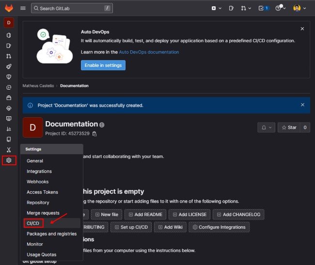
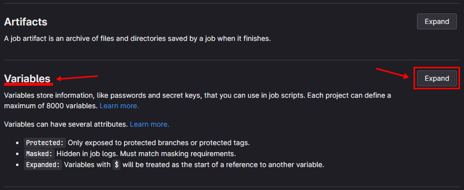
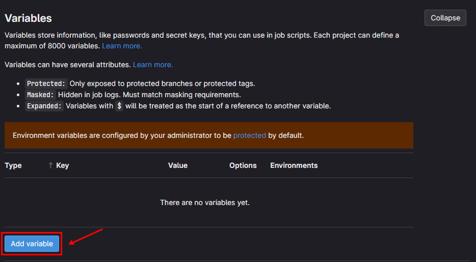
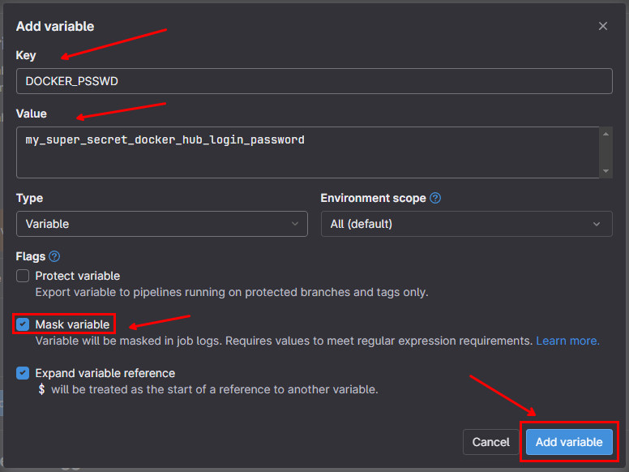
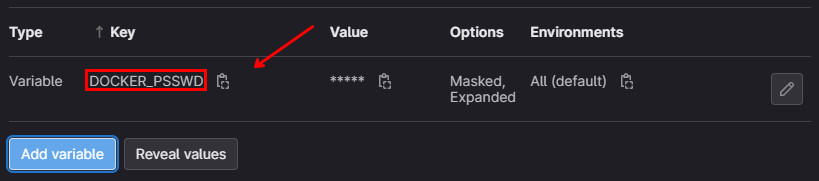
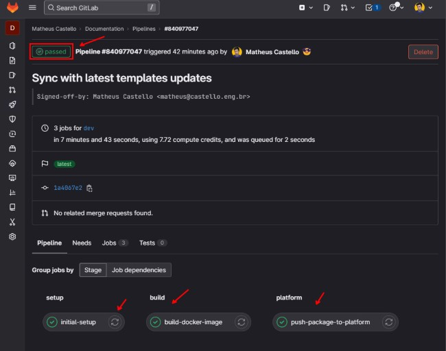

# GitLab CI Integration

All the templates comes with the `.gitlab-ci.yml` file configured to build and create the application package on the Torizon Platform.

## Pre-requisites

- [GitLab account](https://gitlab.com/users/sign_in)
- [GitLab Repository](https://docs.gitlab.com/ee/user/project/repository/)
- [Torizon Platform API v2 Client](./PLATFORM-API-V2-CLIENT.md)
- [Torizon Platform credentials.zip](./TORIZON-PLATFORM-CREDENTIALS.md)
- Project `fill-pipeline-settings` task executed at least once. See [Workspace Tasks](./WORKSPACE-TASKS.md#fill-pipeline-settings) for more information.

## Configure the GitLab Repository

After creating the GitLab repository, you need to configure the secrets and variables to be used in the GitLab CI pipeline.

In the repo page, mouse hover in the `Settings` and click on the `CI/CD`:



Then, click on the `Expand` button from `Variables` section:



Then, click on the `Add variable` button:



This will open the `Add variable` modal window. In the `Key` field, type the name of the variable. In the `Value` field, type the value of the variable. Also make sure to check the `Mask variable` checkbox for the secret data. Then, click on the `Add variable` button:

> ⚠️ In GitLab CI is possible also protect variables to be used only in the protected branches, see [GitLab CI/CD variables](https://docs.gitlab.com/ee/ci/variables/s) for more information.



Then, you will see the variable added to the list:



Do it for all the secrets listed below:

- `DOCKER_PSSWD`: DockerHub registry login password. This is the password from the login name that comes from the `docker_login` property, from `.vscode/settings.json`, see [Workspace Settings](./WORKSPACE-SETTINGS.md#docker_login) for more information.

- `PLATFORM_CLIENT_ID`: Torizon Platform API v2 Client ID. See [Creating a New Torizon Platform API v2 Client](./PLATFORM-API-V2-CLIENT.md) for more information.

- `PLATFORM_CLIENT_SECRET`: Torizon Platform API v2 Client Secret. See [Creating a New Torizon Platform API v2 Client](./PLATFORM-API-V2-CLIENT.md) for more information.

### Adding credentials.zip as CI/CD Variable

To use the TorizonCore Builder to create the Torizon Platform package, we need the `credentials.zip` file available in the CI/CD pipeline. The `.gitlab-ci.yml` expectes to have the `PLATFORM_CREDENDIALS` variable with the base64 encode of the `credentials.zip` file. Execute the follow command to get the base64 encode of the `credentials.zip` file:

```bash
base64 -w 0 ./credentials.zip
```

Then, add the `PLATFORM_CREDENDIALS` variable, with the output from command as value.

> ⚠️ Make sure to check the `Mask variable` checkbox for `PLATFORM_CREDENDIALS` variable.

## Running the CI/CD Pipeline

After configuring the variables needed, your GitLab repository is ready to run the GitLab CI pipeline. Simply push your changes to the repository and the pipeline will be triggered automatically.

The following jobs will be executed:

- `Initial Setup`: This step will verify the environment variables and secrets configured in the repository. If any of the required variables are missing, the workflow will fail fast in this first step;

- `build-docker-image`: This step will run the task `create-production-image` task. This task will create the production image and publish it to the Docker registry. See [Workspace Tasks](./WORKSPACE-TASKS.md#create-production-docker-image) for more information.

- `push-package-to-platform`: This step will run the task `tcb-platform-publish`. This task will create the Torizon Platform package and publish it to the Torizon Platform. See [Workspace Tasks](./WORKSPACE-TASKS.md#tcb-platform-publish) for more information.

- `update-fleet`: This step will run the task `platform-update-fleet`. This task will update the fleet with the new package. See [Workspace Tasks](./WORKSPACE-TASKS.md#platform-update-fleet) for more information.

> ⚠️ The `update-fleet` job will only be executed in a `main` branch push. If you want to trigger a update when pushing in a different branch, you need to change the `if` condition in the `update-fleet` step from the `.gitlab-ci.yml` file. Check the templates repository file: <https://github.com/toradex/vscode-torizon-templates/blob/b35bb0ff7a0832f48a1731e2c13d7b106a00ab80/assets/gitlab/.gitlab-ci.yml#L101>

At the end of the pipeline, if all occurs as expected, you will have the following in the pipeline page:



And the Torizon Platform updated will be triggered, you should have the devices from the fleet with `Update pending` state:


