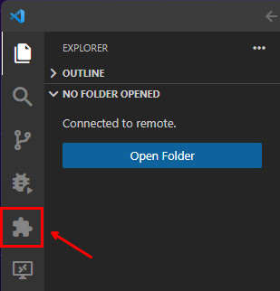
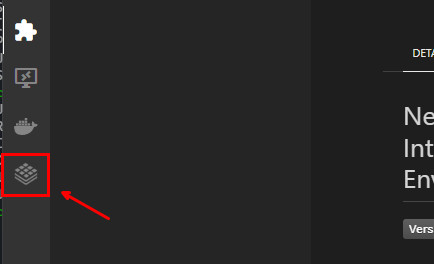
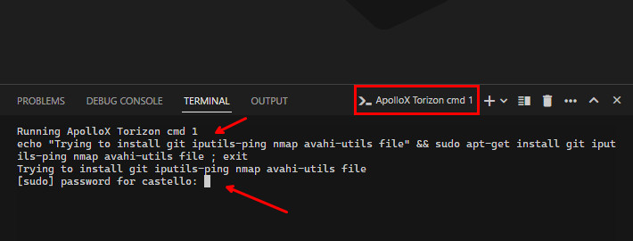
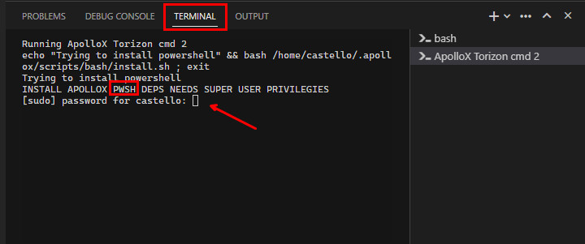

# How To Install

The actual extension installation is done by VS Code getting it from Visual Studio Code Marketplace. But before you can install the extension, you need to install some dependencies.

## Pre-requisites

### 🐧 Linux

- [Debian stable](https://www.debian.org/releases/stable/) or [Ubuntu LTS](https://ubuntu.com/blog/tag/LTS#download) installed on your distro.
- [Visual Studio Code](https://code.visualstudio.com/) installed on your distro.
- [PowerShell Core](https://docs.microsoft.com/en-us/powershell/scripting/install/installing-powershell-core-on-linux?view=powershell-7.1) installed on your machine.
- Docker installed on your distro.
  - Install Docker Engine for [Debian](https://docs.docker.com/engine/install/debian/) or [Ubuntu](https://docs.docker.com/engine/install/ubuntu/).
- [Docker Compose Plugin](https://docs.docker.com/compose/install/) installed on your distro.

After the Docker installation, you need to add your user to the `docker` group. This is required to run the Docker commands without `sudo`:

```bash
sudo groupadd docker
sudo usermod -aG docker $USER
newgrp docker
```

### 🪟 Windows Subsystem for Linux (WSL)

- [Ubuntu](https://ubuntu.com/tutorials/install-ubuntu-on-wsl2-on-windows-10#1-overview) installed on your machine as **WSL 2** distribution.
- [Visual Studio Code](https://code.visualstudio.com/) installed on **Windows** side.
- [PowerShell Core](https://docs.microsoft.com/en-us/powershell/scripting/install/installing-powershell-core-on-linux?view=powershell-7.1) installed on **WSL 2** distro.
- Docker installed on your **WSL 2** distro.
  - Install Docker Engine for [Debian](https://docs.docker.com/engine/install/debian/) or [Ubuntu](https://docs.docker.com/engine/install/ubuntu/).
- [Docker Compose Plugin](https://docs.docker.com/compose/install/) installed on **WSL 2** distro.

After the Docker installation, you need to add your user to the `docker` group. This is required to run the Docker commands without `sudo`. In a new terminal from the **WSL 2** distro run the following commands:

```bash
sudo groupadd docker
sudo usermod -aG docker $USER
newgrp docker
```

## Installing from Visual Studio Marketplace

In VS Code select `Extensions` from the activity bar:



Search for `toradex.apollox-vscode` and install it:


### Automatic Dependencies Installation

After the extension installation a new Torizon icon will be shown in the activity bar, select it for activate the extension.



During the first activation some dependencies validation are run. If any installable dependency is detected, an installation attempt will be performed:

> ⚠️ Take attention to the **terminal** tab that will be opened during the installation process. You will be asked for your `sudo` user password.



> ⚠️ Make sure to also accept the installation of the packages.


Wait for the finish of the packages installation.

> ⚠️ Take attention to the **terminal** tab, another terminal should be opened to try to install PowerShell. You will be asked for your `sudo` user password.



If the installation is successful, the extension will be ready to use.
