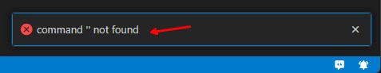
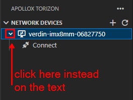

# Torizon IDE Extension ApolloX Known Issues

## v2.0.0

### Devices Network Scanning

- In some network configurations the device may not be detected by the network scan. If it's your case, you can manually add the device by clicking on the `+` icon and input the Torizon device `IP`. See [Connecting a Torizon Device](./CONNECTING-DEVICE.md#connecting-to-a-torizon-device) for more details;

-------

- If your network uses a subnet mask different from `x.x.x.0/24` the network scan may not detect the device. If it's your case, you can manually add the device by clicking on the `+` icon and input the Torizon device `IP`. See [Connecting a Torizon Device](./CONNECTING-DEVICE.md#connecting-to-a-torizon-device) for more details;

-------

- If you are using VPN the network scan could not detect the network devices. If it's your case, you can manually add the device by clicking on the `+` icon and input the Torizon device `IP`. See [Connecting a Torizon Device](./CONNECTING-DEVICE.md#connecting-to-a-torizon-device) for more details;

-------

- By clicking more than once in the `Refresh Devices` icon can result in duplicate entries in the list;

-------

- Clicking in the root text entries from the `NETWORK DEVICES` or `CONNECTED DEVICES` results in the popup with the message:

This is a known issue, if you are trying to expand the entry click instead in the icon:

