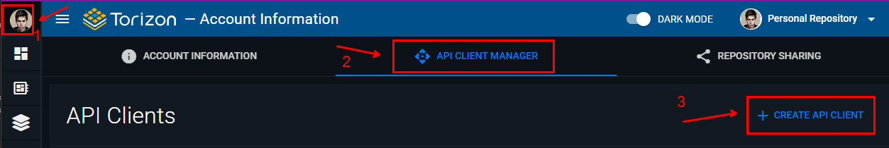
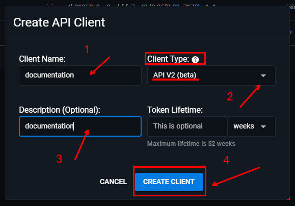
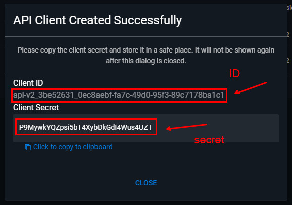

# Creating a New Torizon Platform API v2 Client

This document describes how to create a new Torizon Platform API v2 client.

## Prerequisites

- Account in the [Torizon Platform](https://app.torizon.io/);
  - Account in the Commercial tier;

## Create the API v2 Client

1. Go to `My Account`, click on the user profile picture;
2. Click in to `API CLIENT MANAGER` tab;
3. Click in the `+ CREATE API CLIENT` button;

A new window will be opened, input the required data:

1. `Client Name`: the name of the API Client;
2. `Client Type`: Make sure to select `API v2`;
3. `Client Description`: a description of the API Client (optional);
4. Click `CREATE CLIENT` button to finish;

A new window will be opened with the Client ID and Client Secret.

> ⚠️ The Client Secret will be shown only once, so make sure to copy it to a safe place. If you lose it, you will need to create a new API Client.

