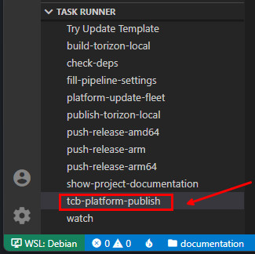
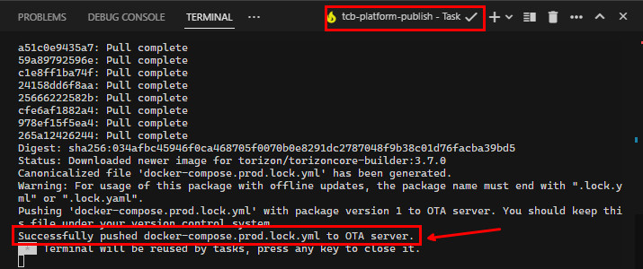
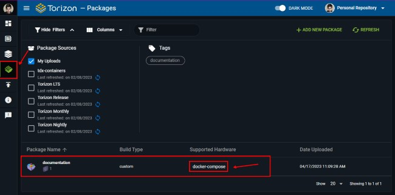

# Create Torizon Platform `docker-compose` Package

After you have generated a production image, and the `docker-compose.prod.yml`, you can create a Torizon Platform `docker-compose` package. This package can be used to deploy, or trigger an update, to a device fleet.

## Prerequisites

- Torizon Platform credentials.zip file. See [How to get Torizon Platform credentials.zip](./TORIZON-PLATFORM-CREDENTIALS.md) for more information;
- Torizon Platform API v2 client token. See [Creating a New Torizon Platform API v2 Client](./PLATFORM-API-V2-CLIENT.md) for more information;

## Creating Package

Run the `tcb-platform-publish` task. See [Workspace Tasks](./WORKSPACE-TASKS.md) for more information.

The task will ask for the following inputs:

- `Docker registry password`: the Docker registry password to use to push the image to DockerHub. This will be stored as a secret in the VS Code vault.

----------

- `Container architecture`: the architecture to build the Docker image. This will be shown as itens to select. Select the architecture that matches the target device.

----------

- `Docker namespace`: the Docker namespace to use to build the image, push it to DockerHub and set in the `docker-compose.prod.yml`. The image name will be `dockerNamespace/applicationName:dockerTag`.

----------

- `Docker tag to use in the production image`: the Docker tag to use in the production image. The image name will be `dockerNamespace/applicationName:dockerTag

> ⚠️ The `Docker tag to use in the production image` input is shown only if the `docker_tag` property is not set in the `.vscode/settings.json`. See [Workspace Settings](./WORKSPACE-SETTINGS.md) for more information.

At the end of the tasks, if all was successful, you will see the following message in the terminal tab:

And the package will be available in the Torizon Platform OTA:

