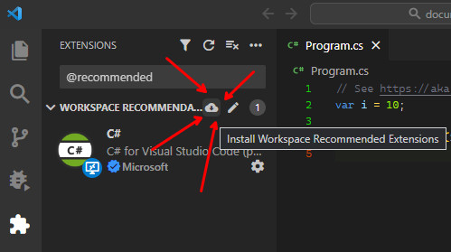
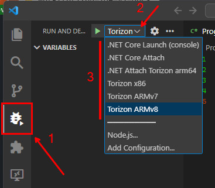
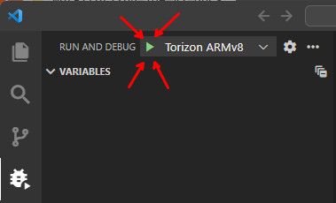
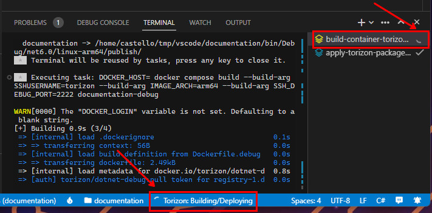
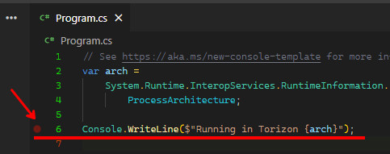
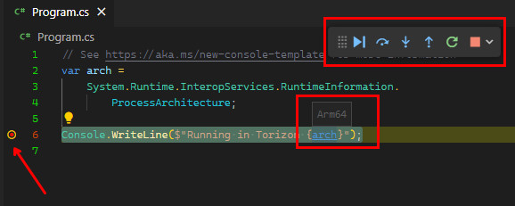

# Remote Deploying/Debugging Projects

One of most helpful features of the Torizon Extension templates is the ability to deploy and debug your projects on a remote device.

## Prerequisites

All the templates has the file `.vscode/extensions.json` which contains the list of recommended extensions for the project. These extensions commonly will add the LSP (language server protocol) support for the project language, the syntax highlight, the code formatting, debugger etc.

> ⚠️ Make sure to have all the recommended extensions installed before proceeding.

To check if the recommended extensions are installed, open the Command Palette (Ctrl+Shift+P) and type `Extensions: Show Recommended Extensions`. This will open the Extensions view with the list of recommended extensions. You can install all by clicking on the `Install Workspace Recommended Extensions` icon button:

## Remote Deploying/Debugging

To deploy and debug your project on the selected default Torizon device, select the debug option on the `Run and Debug` view (Ctrl+Shift+D):

> ⚠️ Select the option that matches to the architecture of the default Torizon device.
> -`Torizon ARMv8`: For arm 64 bit devices;
> -`Torizon ARMv7`: For arm 32 bit devices;

Then click on the `Start Debugging` button (or press F5):

> ⚠️ Once that you have one option selected the VS Code will remember the last option selected and will use it as the default option for the next debug sessions. So, in the next time that you want to debug your project, you can just press F5 and the VS Code will automatically run from the last option selected.

The remote deploy and debug process will start, there is a plenty of tasks that are needed to be executed. This is the flow:

Wait to the finish of the process. The VS Code will automatically change to the `Debug Console` tab, where should have the output logs of the debugger and application.

> ⚠️ Pay attention to the `TERMINAL` tab from  VS Code, where should have the output logs and progress of the remote deploy/debug flow.

Also there is the progress animation on the footer of and for each of the tasks running in the `TERMINAL` tab entries:

## Adding Breakpoints

> ⚠️ The templates are not setup to break at the entry of the application. So, if you want to debug your application, you need to set a breakpoint on the code.

Simple click on the left side of the line number where you want to set the breakpoint:

Then run the debug process (press F5). The application should stop at the breakpoint:

So you can use all common debug features of the VS Code to debug your application. See the [VS Code Debugging](https://code.visualstudio.com/docs/editor/debugging) documentation for more details.
