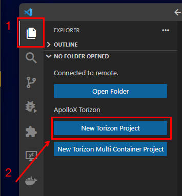
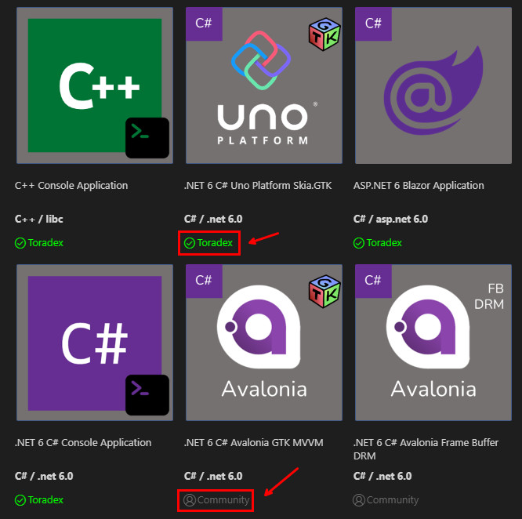
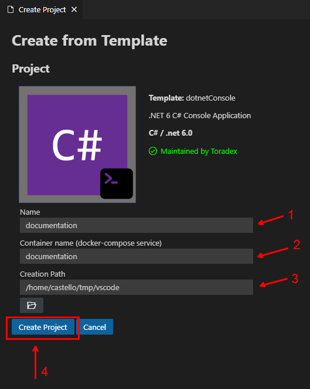
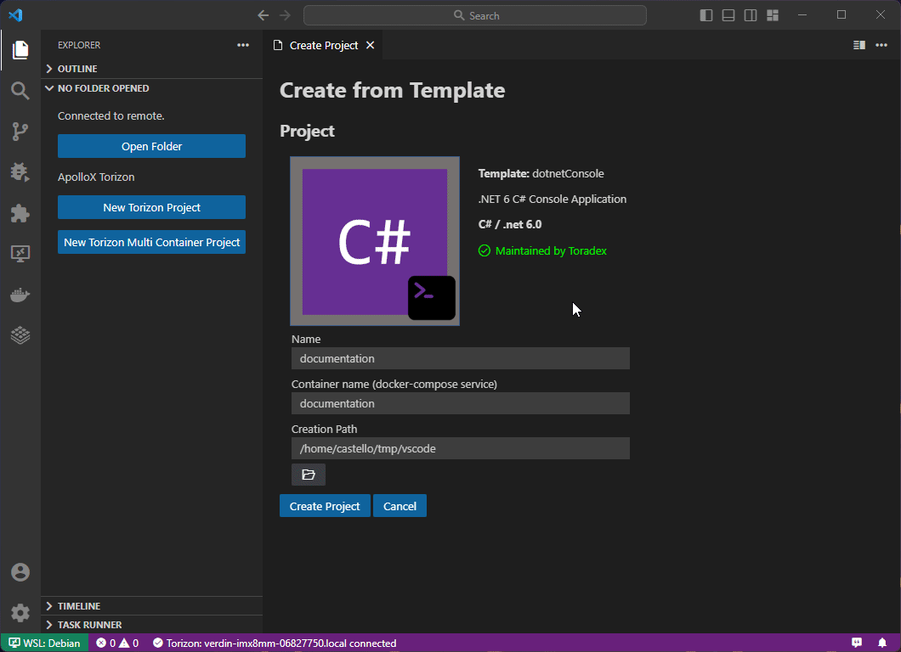

# Creating Single Container Projects

After [installation](./INSTALLATION.md) and [configuration](./GETTING-STARTED.md), connecting the device to the extension, you are ready to go ahead and create your Torizon project.

## Creating a new Single Container Project

Open a new VS Code window and select the `Explorer` on activity bar. There will be two buttons for creating Projects. Click on `New Torizon Project`:

A new tab will be opened with a list of templates that can be used for the project creation. Click on the image describing the template desired to create a new project based on it:

> ⚠️ Note that there is the Toradex supported templates and the community supported templates. Toradex Supported Templates are templates with development stacks commonly used by customers of the Torizon platform. These templates are maintained by the Toradex Torizon team and pass trough a quality assurance process. The quality and maintenance of community templates are the sole responsibility of their [contributors](https://github.com/toradex/vscode-torizon-templates/blob/bookworm/README.md).

After clicking in the template image desired to create a new project, input the project `Name` (must be a valid programming language variable name), project `Container name (docker-compose service)` (must be a valid Docker image name), choose a system folder on `Creation path` to store the new project files and click on `Create Project` button:

Wait for the creation process, a new terminal will be opened showing the creation process:

After the project creation, the VS Code window will be reloaded and the project will be opened.
