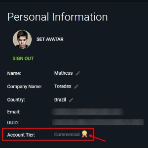

# How to get Torizon Platform `credentials.zip`

Torizon Platform has offline credentials that are used with the TorizonCore Builder to manage the creation of `docker-compose` and customized TorizonCore OS images packages.

## Prerequisites

- Account in the [Torizon Platform](https://app.torizon.io/);
  - Account in the Commercial tier;

## Download the `credentials.zip`

> ⚠️ The `credentials.zip` contains important files to authenticate with the Torizon Platform, and it's not possible rotate it today. Make sure to keep it safe!

1. Go to `My Account`, click on the user profile picture;
2. Scroll to the `Credentials` section;
3. Click in the `DOWNLOAD CREDENTIALS` button;

> ⚠️ The `credentials.zip` contains important files to authenticate with the Torizon Platform, and it's not possible rotate it today. Make sure to keep it safe!
