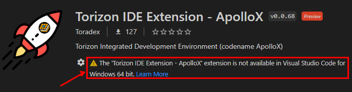
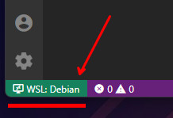
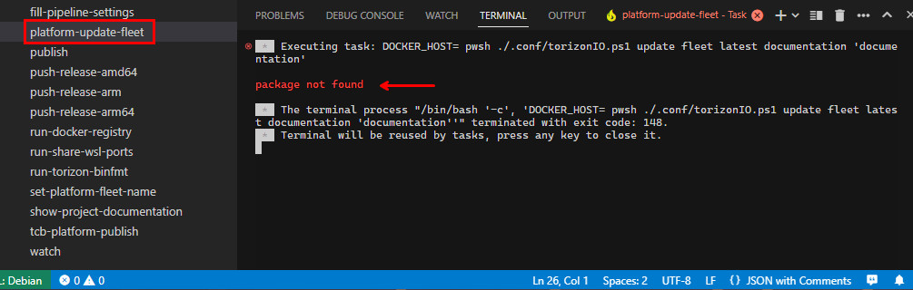
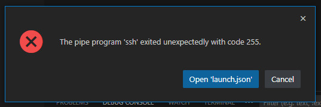
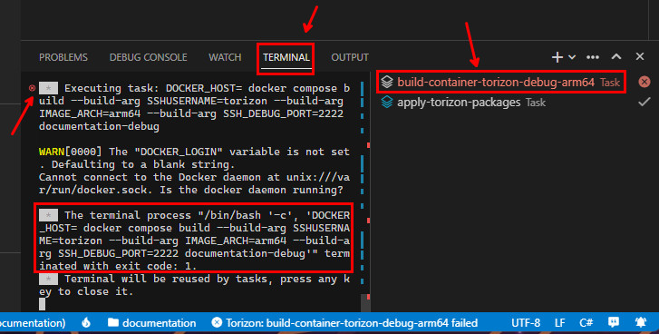

# Troubleshooting

## Port Forwarding

> ⚠️ For the extension to work correctly, it is necessary to have the following ports accessible between your machine and the development board:

- **22** (Dev Board SSH Connection)
- **2375** (Docker API)
- **5002** (Local Docker Registry)
- **2222** (Container SSH Connection)

> ⚠️ These are the most common ports used by the extension, but other ports may be required depending on the template used to create a project. Check the [templates repository](https://github.com/toradex/vscode-torizon-templates/blob/bookworm/templates.json) for more information.

## Extension is not available for Visual Studio Code for Windows 64 bit

If you are getting the following warning message when trying to install the extension:



Is because you are not opening the VS Code connected to the WSL 2. To do that, simple open a new WSL 2 terminal and type:

```bash
code
```

This will automatically open a new VS Code window connected to the WSL 2 distro. You can confirm that by checking the bottom left corner of the VS Code window. Where should present that it is connected to `WSL: <distro name>`:



## Device not reached

If you are getting the following error message when trying `Set Default` a registered device and already checked that the device is connected to the same network as the machine running the VS Code extension and turned on, please execute the follow command in a terminal:

> ⚠️ Replace the IP address with the IP address of the your device.

```bash
ping -W 1 -c 1 192.168.0.62
```

If this is returning:

```bash
ping: socket: Operation not permitted
```

Please set the capability to ping with the following command:

```bash
sudo setcap cap_net_raw+ep /bin/ping
```

## package not found

If you are getting the following error message when trying to trigger a fleet update after run the `platform-update-fleet` task:



> ⚠️ This package should be created first by running the `tcb-platform-publish` task.

Make sure that the package exists in the Torizon Platform.

## The pipe program 'ssh' exited unexpectedly with code

If you are getting the following error message when trying to remote deploy/debug a project:



The issue may not be exactly in SSH, as the message suggests. But it could be that some task in the flow failed, which led to not having the container deployed and running on the target. So, there is no SSH target to connect.

Pay attention on the `Terminal` tab, where should be some error message logs. Also check the last task executed, signaled in red color on the terminal entries. This should give you a hint to identify the task that failed and the root cause of the issue.


