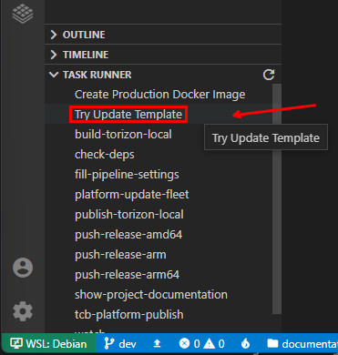
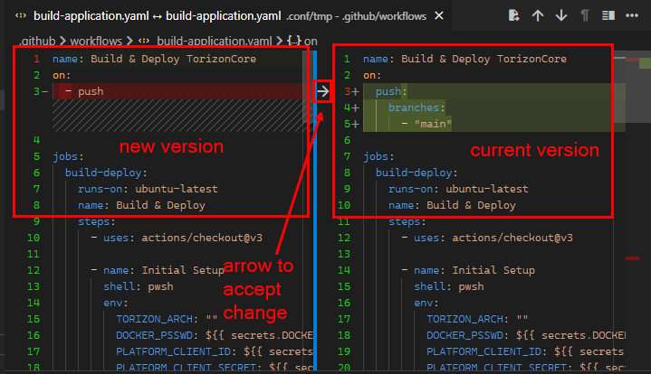
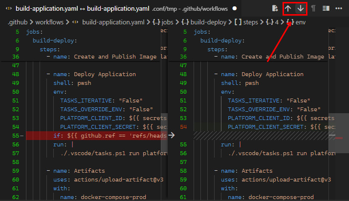

# Updating Project from Template

The Torizon ApolloX templates are updated frequently to add new features and fix bugs. To update your project to the latest template version, follow the steps below:

1. Open the project folder in VS Code.
2. Run the `Try Update Template` task, clicking on it from `TASK RUNNER`:

This will start the update process. If the updater finds a new version of some file it will open a diff window showing the changes, and will stop the updater execution. The left side of the diff tab is the newest version of the file, and the right side is the current version of the file in your project.

You can choose to keep the current version of the file simply by closing the diff tab.

If you want to update the file you need to first accept the changes, one by one, by clicking on the arrow icon on the middle of the two files, this will move the change from the left to the right (from the new to the current version):

> ⚠️ A lot of the files from project templates are designed to be free editable by the user, so the updater will not overwrite them. So pay attention when trying to update the project to the latest from templates, to change only what is needed. The files that are not designed to be editable by the user, mainly the files from `.conf` folder, will be overwritten by the updater.

You can also navigate between changes by clicking on the arrows on the top of the diff tab, the `Previous Change` and `Next Change` buttons:

As soon as you have all the changes that you want accepted, you can save the file and close the diff tab. This will proceed with the updater execution.

> ⚠️ Make sure to save the file before closing the diff tab, otherwise the changes accepted will be lost. Will be necessary run the task again.
