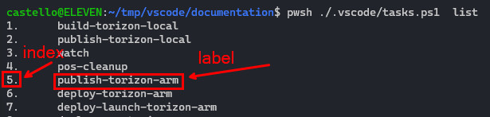
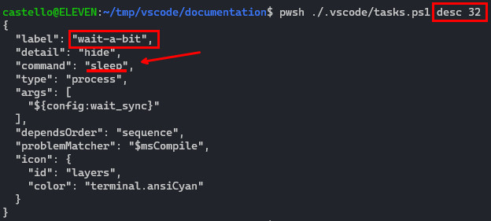
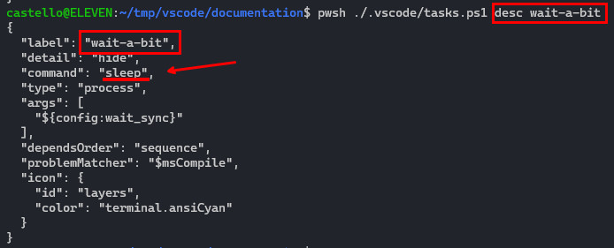
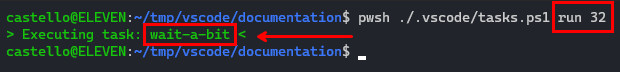
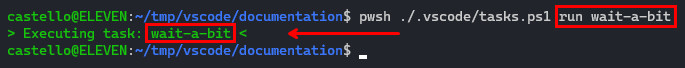

# Using Project Tasks in CLI

Have the possibility to run the project tasks from the command line is very useful when you are working in a CI/CD environment or when you are using a different code editor than Visual Studio Code.

## Prerequisites

- [PowerShell Core](https://docs.microsoft.com/en-us/powershell/scripting/install/installing-powershell-core-on-linux?view=powershell-7.1) installed on your machine.
- Project created with the [Torizon ApolloX Extension](https://marketplace.visualstudio.com/items?itemName=toradex.apollox-vscode) for Visual Studio Code.

## Using tasks.ps1

The `tasks.ps1` script is a PowerShell script that can be used to run the project tasks from the command line. It is located in `.vscode` folder of the project.

To run the script, open a terminal and navigate to the project folder. Then run the following command:

```bash
pwsh .vscode/tasks.ps1
```

This will show the help message:

```bash
usage:
    list                    : list the tasks.json labels defined
    desc <task_label>       : describe the task <task_label>
    desc <task_index>       : describe the task <task_index>
    run <task_label>        : run the task <task_label>
    run <task_index>        : run the task <task_index>
    run-nodeps <task_label> : run the tasks without dependencies <task_label>
```

### Listing tasks

The `list` command can be used to list the tasks defined in the `tasks.json` file.

```bash
pwsh .vscode/tasks.ps1 list
```

The list will show the tasks by index and by label name:



This data can be used to describe and run the tasks.

> ⚠️ The index is the position of the task in the `tasks.json` file. The index is not the same for all templates, it can be change. If you want to use in a generic way the common tasks, use always the label name.

### Describing

The `desc` command can be used to describe the tasks defined in the `tasks.json` file. This will show the definition of the task, the command, args, and the depends on tasks, in the JSON format that is used in the `tasks.json` file.

You can describe the task by the index:

```bash
pwsh .vscode/tasks.ps1 desc 32
```



Or by the label name:

```bash
pwsh .vscode/tasks.ps1 desc wait-a-bit
```



### Running

The `run` command can be used to run the tasks defined in the `tasks.json` file.

You can run the task by the index:

```bash
pwsh .vscode/tasks.ps1 run 32
```



Or by the label name:

```bash
pwsh .vscode/tasks.ps1 run wait-a-bit
```



### Running Without Dependencies

The `run-nodeps` command can be used to run the tasks defined in the `tasks.json` file without running the depends on tasks, defined by the `dependsOn` property.

If for some reason you want to run a task without running the dependencies, you already ran the dependency tasks once and want to test only the specific call for example, to speed up the call you can use this command.

> ⚠️ For now the `run-nodeps` can be used only with the task label name.
