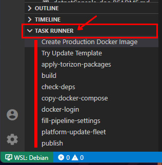
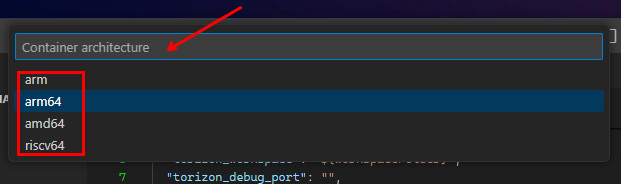
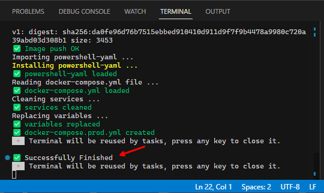
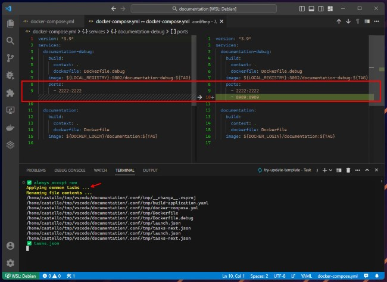
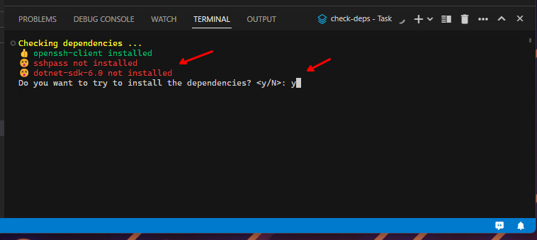
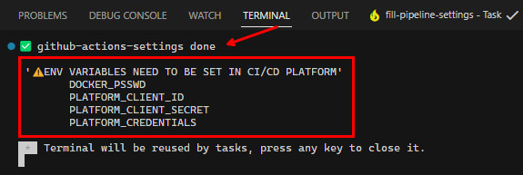

# Workspace Tasks

Some common tasks are available in the VS Code Task Runner menu. Other are template specific and are described in their respective documentation. To execute a tasks click on the item from `TASK RUNNER` drop menu list from the VS Code Explorer activity bar:

> ⚠️ This documentation describe all the possible inputs that the tasks requires. If the task is not asking for some input, it means that the input has their value already stored in the `.vscode/settings.json`. If you want to change the value of the input, you can change it in the `.vscode/settings.json` file or by cleaning the value in the `.vscode/settings.json`, then run the task again. Check the [Workspace Settings](./WORKSPACE-SETTINGS.md) documentation for more information.

## Create Production Docker Image

This task has automation steps to build the production Docker image. The production Docker image is based in the `Dockerfile` file.

Inputs are needed to complete the task and are asked in the start of the task:

- `Docker namespace`: the Docker namespace to use to build the image, push it to DockerHub and set in the `docker-compose.prod.yml`. The image name will be `dockerNamespace/applicationName:dockerTag`.

----------

- `Docker tag to use in the production image`: the Docker tag to use in the production image. The image name will be `dockerNamespace/applicationName:dockerTag`.

----------

- `Docker registry password`: the Docker registry password to use to push the image to DockerHub. This will be stored as a secret in the VS Code vault.

----------

- `Container architecture`: the architecture to build the Docker image. This will be shown as itens to select. Select the architecture that matches the target device.

Wait for the task to finish. The production Docker image will be built and pushed to DockerHub. The `docker-compose.prod.yml` file will be updated with the new image and version set by the user inputs, you should have something like the image below in the terminal tab on the finish of the task:

## Try Update Template

This task has automation steps to update the project based on the template used to create it.

> ⚠️ Pay attention when running this task. Some common files will be overwritten. If you have made changes to these files, you should backup the project first before running this task. The other files will be open in the diff editor, for each file, to allow you to review the changes and decide if you want to keep them or not.

The Torizon templates are in constant evolution, and this tasks will be useful if you face some issue and need to update the project to the latest version of the template.

## check-deps

This task will check if the dependencies needed to run the project are installed in the host machine. The dependencies are read from the `.conf/deps.json` file. This task is automatically executed when the project is opened in  VS Code.

> ⚠️ These dependencies are not to be used inside the container, they are to be used in the host machine.

If some dependency is not installed, the task will show a message in the terminal tab with the missing dependencies and will ask to the user if he wants to install them. If the user accepts, the task will try to install the package using the `apt`.

> ⚠️ Pay attention to the terminal tab your root password may be asked to complete the `apt install`.

## fill-pipeline-settings

This task will fill the properties that are needed to be set in the `.vscode/settings.json` to correctly run the GitHub Actions or GitLab CI pipelines.

Inputs are needed to complete the task and are asked in the start of the task:

- `Torizon Platform API v2 Client ID`: the Torizon Platform API v2 Client ID to use to authenticate in the Torizon Platform API v2. You can get it creating a new API Client in the [Torizon IO Platform](https://app.torizon.io/). Check the [Creating a New Torizon Platform API v2 Client](./PLATFORM-API-V2-CLIENT.md) documentation for more information.

----------

- `Torizon Platform API v2 Client Secret`: the Torizon Platform API v2 Client Secret to use to authenticate in the Torizon Platform API v2. You can get it creating a new API Client in the [Torizon IO Platform](https://app.torizon.io/). Check the [Creating a New Torizon Platform API v2 Client](./PLATFORM-API-V2-CLIENT.md) documentation for more information. This value will be stored as a secret in the VS Code vault.

----------

- `Torizon Platform Fleet name to update`: This is the name of the fleet that will be updated in the finish of the CI/CD pipeline. You can create an get the fleet name from the [Torizon IO Platform](https://app.torizon.io/).

At the finish of the task, the `.vscode/settings.json` file will be updated with the values set by the user inputs, you should have something like the image below in the terminal tab on the finish of the task:

> ⚠️ Some of the project settings to run the CI/CD pipeline comes from the `.vscode/settings.json` file. But the secret data, that is stored in the VS Code vault, is not exported. These settings are needed to be set in the CI/CD platform as protected environment variables. Check the [Github Actions Integration](./GITHUB-ACTIONS.md) and [GitLab CI Integration](./GITLAB-CI.md) documentation for more details.

## platform-update-fleet

This task will trigger the update of the fleet in the Torizon Platform with the latest version of the application published to the platform.

Inputs are needed to complete the task and are asked in the start of the task:

- `Torizon Platform Fleet name to update`: This is the name of the fleet that will receive the update trigger. You can create an get the fleet name from the [Torizon IO Platform](https://app.torizon.io/).

----------

- `Torizon Platform API v2 Client ID`: the Torizon Platform API v2 Client ID to use to authenticate in the Torizon Platform API v2. You can get it creating a new API Client in the [Torizon IO Platform](https://app.torizon.io/). Check the [Creating a New Torizon Platform API v2 Client](./PLATFORM-API-V2-CLIENT.md) documentation for more information.

----------

- `Torizon Platform API v2 Client Secret`: the Torizon Platform API v2 Client Secret to use to authenticate in the Torizon Platform API v2. You can get it creating a new API Client in the [Torizon IO Platform](https://app.torizon.io/). Check the [Creating a New Torizon Platform API v2 Client](./PLATFORM-API-V2-CLIENT.md) documentation for more information. This value will be stored as a secret in the VS Code vault.

## push-release-*

These tasks will build the application based in the production Dockerfile and push the image to the DockerHub. The image will be `dockerUserLogin/applicationName:archSelected`.

There is one task for each architecture supported by TorizonCore:

- `push-release-arm64`
- `push-release-arm`
- `push-release-amd64`

Inputs are needed to complete the task and are asked in the start of the task:

- `Docker registry user login`: the Docker registry user login to use to push the image to DockerHub.

----------

- `Docker registry password`: the Docker registry password to use to push the image to DockerHub. This will be stored as a secret in the VS Code vault.

## show-project-documentation

This task will open the project specific documentation in a new tab. It's download it from [vscode-torizon-templates-documentation](https://github.com/toradex/vscode-torizon-templates-documentation) repository, as a markdown file, and open it in the VS Code markdown preview.

## tcb-platform-publish

This task will build the production image based on the Dockerfile and push it to the Torizon Platform creating a new `docker-compose` package.

> ⚠️ This task needs the `credentials.zip` file from Torizon Platform in the root of the project folder. You can get it from the [Torizon Platform](https://app.torizon.io/). Check the [How to get Torizon Platform credentials.zip](./TORIZON-PLATFORM-CREDENTIALS.md) documentation for more information.

Inputs are needed to complete the task and are asked in the start of the task:

- `Docker registry password`: the Docker registry password to use to push the image to DockerHub. This will be stored as a secret in the VS Code vault.

----------

- `Container architecture`: the architecture to build the Docker image. This will be shown as itens to select. Select the architecture that matches the target device.

----------

- `Docker namespace`: the Docker namespace to use to build the image, push it to DockerHub and set in the `docker-compose.prod.yml`. The image name will be `dockerNamespace/applicationName:dockerTag`.

----------

- `Docker tag to use in the production image`: the Docker tag to use in the production image. The image name will be `dockerNamespace/applicationName:dockerTag`
